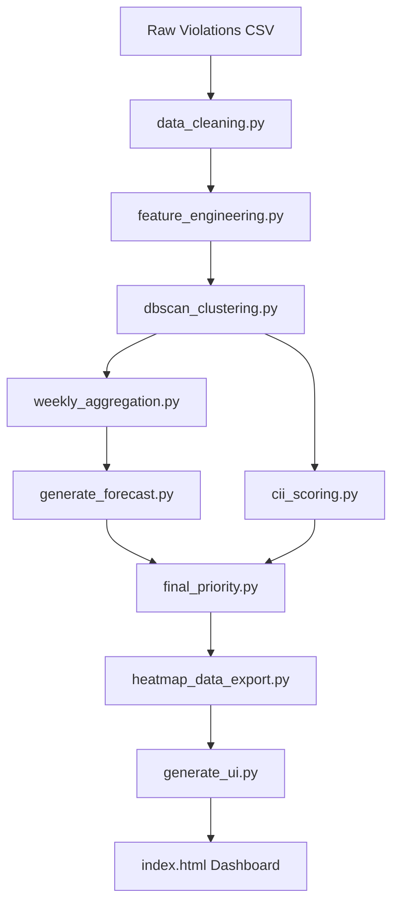

# Bengaluru Traffic Gridlock Patrol Optimizer (Round 2)

An end-to-end predictive analysis, forecasting pipeline, and interactive spatial dashboard designed to optimize traffic patrol allocation in Bengaluru by identifying, forecasting, and prioritizing high-risk parking violation hotspots.

---

## 1. Project Overview & Objectives

Traffic congestion in Bengaluru is heavily amplified by unauthorized and hazardous parking. This repository provides a data-driven system to:
1. **Identify Hotspots**: Cluster historical parking violations into high-density zones using spatial DBSCAN clustering.
2. **Forecast Future Volumes**: Project weekly violation frequencies for each hotspot across different shifts/time bands.
3. **Assess Congestion Impact**: Quantify each zone's potential to disrupt traffic flow via a **Congestion Impact Index (CII)** based on vehicle weight, blockage characteristics, and proximity to major junctions.
4. **Prioritize Patrol Dispatch**: Blend predicted violation volume, severity, and CII to tier zones (Red/Amber/Green) and export geo-data to an interactive officer briefing dashboard.

---

## 2. The Approach & Implementation Journey

Here is the step-by-step methodology of what was done from scratch to design, train, regularize, and build this optimization system:

### Step 1: Exploratory Data Analysis & Profiling
We initiated the project by profiling the raw police records dataset containing ~248k rows. We analyzed the missing rate of each attribute, defined coordinate bounding boxes to remove geographical noise outside the Bengaluru metropolitan area, and profiled the hourly, weekly, and violation type distributions. A 50,000-record sample was extracted to compile an interactive HTML data-profiling report to explore structural characteristics of the dataset.

### Step 2: Data Cleaning & Feature Engineering
We standardized the geographical variables (mapping lat/lon ranges, computing distance from the city center), engineered cyclic time variables (converting hours, days of the week, and months to sine/cosine coordinates to capture cyclical patterns), and structured shift time-bands (`morning_peak`, `mid_day`, `late_night`). We also calculated base parameters like junction multipliers and vehicle blockage weights based on vehicle weight categories.

### Step 3: Density-Based Spatial Clustering
We formulated a spatial clustering pipeline using the **DBSCAN** algorithm to group individual violations into physical hotspots:
- Used a **K-Distance elbow plot** (via BallTree NearestNeighbors) to select the optimal spatial resolution.
- Settled on `eps = 0.0005` (~55m radius) and `min_samples = 50` to isolate high-density hotspots while ignoring scattered outliers.
- Grouped **86.57% of the violations into 317 distinct geographical clusters** and created a unified **Cluster Registry** compiling centroids, radii, dominant stations, and base severity.

### Step 4: Time-Series Formulation & Weekly Aggregation
To forecast hotspots over time, we reformulated the static historical data as a time-series problem. We aggregated individual violations into a **weekly time-series grain** grouped by `(cluster_id, time_band, week)`. This preserves density patterns while providing a uniform, sequential frequency index for modeling.

### Step 5: Forecasting Model Exploration & Validation
To establish a production-grade forecast:
- We built a strict **chronological train/test split** (split at week `2024-02-26` with 6 held-out test weeks) to prevent future data leaking into the training phase.
- We constructed rolling lag features (lags 1-3, 3-week rolling means/stds, trend direction, expanding averages) and trained a **LightGBM Regressor** to predict the next week's violation volume.
- We compared the LightGBM model against naive and historical baseline forecasts. The evaluation revealed that the **Historical Mean Model outperformed LightGBM (MAE 13.09 vs. 15.02)**. Because traffic violations are highly stationary and our historical timeline is 23 weeks, the expanding mean acts as a strong regularizer, making it the selected production forecasting model.

### Step 6: Mathematical Optimization & Regularization
We refined the scoring formulas to address structural limitations:
- **Decoupled Double Counting**: Removed parameters like `time_demand` and `junction_mult` from the hotspot score and isolated them strictly inside the CII (Congestion Impact Index) index so the hotspot score measures only pure volume × severity.
- **Empirical Severity Shrinkage**: Addressed small-sample-size noise (where tiny clusters with 1-3 total violations outranked major zones because of a single multi-type violation) by implementing **Bayesian Empirical Shrinkage ($K=30$)** to blend a cluster's severity toward the global mean severity ($0.0128$).

### Step 7: Geo-JSON Pipeline & UI Integration
We joined the forecasted volume, adjusted severity, and CII to calculate the final priority scores. Slices were tiered into Red (top 20%), Amber (next 30%), and Green (bottom 50%) zones. We filtered out the Green tier to avoid map clutter and exported the priority zones as a structured JSON payload. We then developed a self-contained Leaflet.js dashboard (`index.html`) using a dark cyber-grid theme with real-time statistics, search filters, and dispatch simulation controls.

---

## 3. Core Pipeline Architecture

The project is structured as a modular pipeline, with each step separated into individual scripts under `src/`:



### Script Directory & Pipeline Flow:
1. **Data Cleaning & Feature Engineering** (`src/data_cleaning.py`, `src/feature_engineering.py`): Parses raw police records, cleans coordinate anomalies, normalizes spatial bounds, and maps temporal intervals.
2. **DBSCAN Spatial Clustering** (`src/dbscan_clustering.py`): Performs spatial clustering using `eps = 0.0005` (~55m) and `min_samples = 50`. Outputs `clustered_violations.csv` and `cluster_registry.csv`.
3. **Weekly Aggregation** (`src/weekly_aggregation.py`): Aggregates per-violation rows into weekly time-series bins grouped by `(cluster_id, time_band, week)`.
4. **Production Forecast Generator** (`src/generate_forecast.py`): Calculates the production expanding-mean forecast for the upcoming week for each series.
5. **CII Scoring** (`src/cii_scoring.py`): Computes the static Congestion Impact Index (CII) per zone using junction presence, vehicle blockage parameters, and shift demand.
6. **Final Priority Scoring** (`src/final_priority.py`): Joins forecasted counts and CII, applies severity shrinkage regularization, and segments zones into **Red** (top 20%), **Amber** (next 30%), and **Green** (bottom 50%) tiers.
7. **Heatmap Data Export** (`src/heatmap_data_export.py`): Filters for priority (Red/Amber) tiers and exports a structured JSON payload for the UI.
8. **UI Generator** (`src/generate_ui.py`): Compiles predict-ready data and writes a self-contained interactive Leaflet.js dashboard (`index.html`).

---

## 4. Key Methodological Decisions & Modeling Results

### A. Production Forecasting Model Selection
During validation using a chronological train/test split (split at week `2024-02-26` with 4,677 train rows / 2,282 test rows), we evaluated a LightGBM regressor with rolling lag features against simple baselines:

| Model / Baseline | MAE (Next-Week Violations) | RMSE (Next-Week Violations) | Status |
| :--- | :---: | :---: | :---: |
| **Historical Mean Baseline** | **13.09** | **37.27** | **Active (Production)** |
| **LightGBM Regressor (Lags 1-3)** | **15.02** | **43.64** | *Rejected* |
| **Naive Lag-1 Baseline** | **16.18** | **49.01** | *Rejected* |

* **Decision**: We adopted the **Historical Mean** model as our production forecast engine. Because the observation window is relatively short (23 weeks) and traffic patterns are highly stationary, a simple expanding mean acts as a strong regularizer, whereas tree-based models overfit to weekly noise.
* *For details, refer to the [MODEL_DECISION_LOG.md](MODEL_DECISION_LOG.md) file.*

### B. Bayesian Severity Shrinkage
A key issue discovered during evaluation was that low-volume clusters (1-3 total violations) with a single multi-type violation record were outranking major hotspots because `mean_severity_norm` is a noisy average at small sample sizes. 
- **Fix**: We implemented **Bayesian Empirical Shrinkage** on the severity index before score normalization:
  $$\text{Adjusted Severity} = \frac{N \times \text{Own Severity} + K \times \text{Global Severity}}{N + K}$$
- **Parameter**: We set $K = 30$ violations as prior weight. This effectively pulls tiny clusters towards the global average ($0.0128$) while allowing large density zones (such as Upparpet, with hundreds of violations) to rely fully on their measured average.

### C. Decoupling Priority Terms to Avoid Double-Counting
We decoupled variables to ensure the two-stage prioritization model doesn't collapse into a single correlated score:
- **Hotspot Score** represents **Volume × Severity** only.
- **CII Score** captures **Junction Proximity (40%) + Vehicle Blockage (30%) + Shift Demand (30%)**.
- This separation avoids double-counting parameters like `time_demand_multiplier` and `junction_multiplier` (which previously sat in both equations) and allows the system to distinguish between high-volume/low-impact zones and moderate-volume/high-impact zones.

---

## 5. Folder Structure

```text
.
├── configs/
│   └── config.yaml                 # Configuration parameters, input/output paths, and thresholds
├── data/                           # Excluded from git tracking except for .gitkeep structure
│   ├── raw/                        # Raw source datasets
│   └── processed/                  # Intermediate, weekly features, and finalized priority CSVs
├── models/                         # Serialized forecast models and metrics
├── outputs/
│   └── plots/                      # Saved EDA, correlation, and distribution charts
├── reports/
│   ├── dataset_profile_report.html # Interactive HTML profiling report (50k sample)
│   ├── eda_summary.md              # EDA summary for the raw dataset
│   └── clustered_violations_eda.md # Comprehensive EDA report for the clustered data
├── src/                            # Modular pipeline Python package
│   ├── cii_scoring.py              # Congestion Impact Index scoring
│   ├── data_cleaning.py            # Cleans raw coordinates and attributes
│   ├── data_loader.py              # Custom dataloaders
│   ├── dbscan_clustering.py        # Spatial DBSCAN clustering
│   ├── eda_report.py               # Raw dataset EDA runner
│   ├── feature_engineering.py      # Spatial normalization and multipliers
│   ├── final_priority.py           # Blends forecast and CII with Bayesian shrinkage
│   ├── generate_forecast.py        # Production expanding-mean forecast generator
│   ├── generate_ui.py              # Builds and injects data into the index.html dashboard
│   ├── heatmap_data_export.py      # Filters priority tiers and exports JSON
│   ├── hotspot_scoring.py          # Historical hotspot scoring
│   ├── model.py                    # Classical models and PyTorch MLP architectures
│   ├── rolling_features.py         # Lag/expanding features generator
│   ├── train.py                    # Classical model training wrapper
│   ├── train_forecast_model.py     # Training and validation paths for LightGBM
│   └── utils.py                    # Logging, seeds, plotting, and config helpers
├── .gitignore                      # Prevents committing huge datasets or cache files
├── index.html                      # Interactive Leaflet.js patrol-briefing dashboard
├── MODEL_DECISION_LOG.md           # Documentation for model selection and MAE comparison
├── README.md                       # Comprehensive project documentation
├── requirements.txt                # Python dependencies list
└── sample_clustered_violations.csv # 10k random sample of processed violations
```

---

## 6. How to Run the Pipeline

To run the pipeline on the full dataset and generate the outputs, execute the following commands in order from the repository root:

```bash
# 1. Aggregate clustered violations into weekly series
python -m src.weekly_aggregation

# 2. Compute Congestion Impact Index (CII) per zone
python -m src.cii_scoring

# 3. Generate production historical-mean forecasts
python -m src.generate_forecast

# 4. Compute final priority scores, apply shrinkage, and assign tiers
python -m src.final_priority

# 5. Filter Red/Amber tiers and export geo-data payload
python -m src.heatmap_data_export

# 6. Rebuild the interactive dashboard HTML file
python -m src.generate_ui
```

---

## 7. Accessing the Interactive Dashboard

Once the pipeline completes, you can open and interact with the patrol dispatcher dashboard (`index.html`) in your browser.

### Option A: Direct Open (Double-Click)
The predictions and geographical hotspots are compiled directly into the HTML code. 
- Open your file explorer and double-click `index.html` at the repository root.

### Option B: Local HTTP Server
We run a background web server bound to port `8000`. You can access it directly at:
[http://127.0.0.1:8000/index.html](http://127.0.0.1:8000/index.html)

### Key Dashboard Features:
- **Shift Filtering**: Toggle hotspots for `Morning Peak`, `Mid Day`, or `Late Night` shifts.
- **Interactive Map**: View pulsing markers colored by tier (Red = Top 20% risk, Amber = Next 30% risk). Circle sizes scale with their priority score.
- **Search & Focus**: Search for police stations (e.g. "HAL", "Upparpet") in the sidebar. Clicking any zone list item will pan the map to that marker and open its detailed metrics.
- **Patrol Dispatch**: Click the "Dispatch Patrol" button inside any marker popup to simulate an officer assignment.

---

## 8. Technical Deep Dive: Preprocessing, Feature Engineering & Priority Scoring

This section explains the exact mathematical formulations and feature engineering choices implemented in this pipeline.

### A. Data Preprocessing & Cleaning (`data_cleaning.py`)
- **Geographic Bounding Box Filtering**: Any records with latitude/longitude coordinates falling outside the boundaries of metropolitan Bengaluru ($12.80 \le \text{lat} \le 13.30$ and $77.44 \le \text{lon} \le 77.78$) are flagged as noise/anomalies and dropped.
- **Validation Status Filtering**: Retains only records whose `validation_status` is either empty (null), `"approved"`, or `"created1"`. Any rejected, duplicate, or pending records are filtered out.
- **UTC to IST Timezone Conversion**: Converts UTC timestamps to Indian Standard Time (Asia/Kolkata timezone) to align time bands with real-world officer shift cycles in Bengaluru.
- **Physical Vehicle Weights**: Maps vehicle types to numeric blockage values:
  - **Heavy/Utility Vehicles (1.0)**: private buses, LGVs, maxi-cabs.
  - **Medium/Standard Vehicles (0.7-0.6)**: passenger cars, vans, goods autos.
  - **Light/Two-Wheelers (0.2)**: motorcycles, scooters, mopeds.

### B. Feature Engineering (`feature_engineering.py`)
- **Cyclical Time Encoding**: To preserve chronological proximity (e.g., 23:00 is close to 00:00, Sunday is close to Monday), hours, days of the week, and months are encoded as cyclical sine and cosine functions:
  $$\text{hour\_sin} = \sin\left(\frac{2\pi \times \text{hour}}{24}\right), \quad \text{hour\_cos} = \cos\left(\frac{2\pi \times \text{hour}}{24}\right)$$
  $$\text{dow\_sin} = \sin\left(\frac{2\pi \times \text{day\_of\_week}}{7}\right), \quad \text{dow\_cos} = \cos\left(\frac{2\pi \times \text{day\_of\_week}}{7}\right)$$
- **Distance from City Center**: Measures the Euclidean distance of each violation from the center coordinates of Bengaluru ($12.9716, 77.5946$), which is then normalized using a `MinMaxScaler`.
- **Cyclical Shift Time-Bands**: Mapped from the local hour:
  - `late_night` (23:00 to 05:00)
  - `morning_peak` (06:00 to 09:00)
  - `mid_day` (10:00 to 15:00)
  - `evening` (16:00 to 19:00)
  - `night` (20:00 to 22:00)
- **Record Severity Encoding**: Maps specific violation types to severity indices (e.g., `PARKING IN A MAIN ROAD = 1.0`, `NO PARKING / WRONG PARKING = 0.6`, `PARKING ON FOOTPATH = 0.5`). This is multiplied by the violation count in that specific record (since a single report can log multiple offenses) to construct `combined_severity_norm`.

### C. Congestion Impact Index (CII) Scoring (`cii_scoring.py`)
CII represents the static vulnerability/blockage profile of a zone. It is computed at the `(cluster_id, time_band)` grain and does not vary week-to-week:
$$\text{CII Score} = 0.4 \times \text{Junction Proxy} + 0.3 \times \text{Vehicle Blockage} + 0.3 \times \text{Time Demand}$$
Where:
- **Junction Proxy**: $1.0$ if the cluster center is near a major junction (prefixed with `"BTP"`), $0.5$ otherwise.
- **Vehicle Blockage**: The average `vehicle_weight` of all violations historically logged in that zone.
- **Time Demand**: Mapped demand multiplier corresponding to the shift (e.g. `morning_peak = 1.0`, `late_night = 0.2`).

### D. Hotspot Score Prediction & Bayesian Shrinkage (`final_priority.py`)
1. **Forecast Volume**: The production pipeline uses the expanding historical average of the series' weekly counts to forecast the next week's predicted count $V_{pred}$.
2. **Empirical Severity Shrinkage**: Low-volume clusters are regularized to prevent noisy averages from distorting hotspot priority. Each cluster's mean severity index $S_{raw}$ is smoothed toward the global average severity $S_{global} = 0.0128$ using $K = 30$:
   $$S_{shrunk} = \frac{N \times S_{raw} + 30 \times 0.0128}{N + 30}$$
   where $N$ is the total historical violations observed in that zone.
3. **Hotspot Score**: The raw index is computed as:
   $$\text{Hotspot Score Raw} = V_{pred} \times S_{shrunk}$$
   This raw score is normalized globally to range from $0.0$ to $1.0$ across all 939 zones, yielding the final `hotspot_score`.
4. **Final Prioritization**: The final score blends predicted volume/severity (Hotspot) with road blockage vulnerability (CII):
   $$\text{Final Priority Score} = \text{Hotspot Score} \times \text{CII Score}$$
   This product ensures that a zone is flagged as high priority (**Red Tier**) only if it has both high expected violation volume/severity *and* occurs in a highly vulnerable location (e.g., heavy vehicles blocking a major junction during peak hours).

