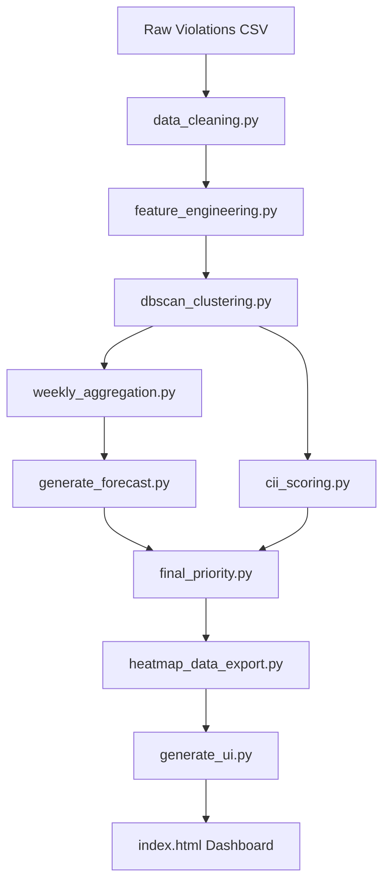

# Bengaluru Traffic Gridlock Patrol Optimizer (Round 2)

An end-to-end predictive analysis, forecasting pipeline, and interactive spatial dashboard designed to optimize traffic patrol allocation in Bengaluru by identifying, forecasting, and prioritizing high-risk parking violation hotspots.

---

## 1. Project Overview & Objectives

Traffic congestion in Bengaluru is heavily amplified by unauthorized and hazardous parking. This repository provides a data-driven system to:
1. **Identify Hotspots**: Cluster historical parking violations into high-density zones using spatial DBSCAN clustering.
2. **Forecast Future Volumes**: Project weekly violation frequencies for each hotspot across different shifts/time bands.
3. **Assess Congestion Impact**: Quantify each zone's potential to disrupt traffic flow via a **Congestion Impact Index (CII)** based on vehicle weight, blockage characteristics, and proximity to major junctions.
4. **Prioritize Patrol Dispatch**: Blend predicted violation volume, severity, and CII to tier zones (Red/Amber/Green) and export geo-data to an interactive officer briefing dashboard.

---

## 2. Core Pipeline Architecture

The project is structured as a modular pipeline, with each step separated into individual scripts under `src/`:



### Script Directory & Pipeline Flow:
1. **Data Cleaning & Feature Engineering** (`src/data_cleaning.py`, `src/feature_engineering.py`): Parses raw police records, cleans coordinate anomalies, normalizes spatial bounds, and maps temporal intervals.
2. **DBSCAN Spatial Clustering** (`src/dbscan_clustering.py`): Performs spatial clustering using `eps = 0.0005` (~55m) and `min_samples = 50`. Outputs `clustered_violations.csv` and `cluster_registry.csv`.
3. **Weekly Aggregation** (`src/weekly_aggregation.py`): Aggregates per-violation rows into weekly time-series bins grouped by `(cluster_id, time_band, week)`.
4. **Production Forecast Generator** (`src/generate_forecast.py`): Calculates the production expanding-mean forecast for the upcoming week for each series.
5. **CII Scoring** (`src/cii_scoring.py`): Computes the static Congestion Impact Index (CII) per zone using junction presence, vehicle blockage parameters, and shift demand.
6. **Final Priority Scoring** (`src/final_priority.py`): Joins forecasted counts and CII, applies severity shrinkage regularization, and segments zones into **Red** (top 20%), **Amber** (next 30%), and **Green** (bottom 50%) tiers.
7. **Heatmap Data Export** (`src/heatmap_data_export.py`): Filters for priority (Red/Amber) tiers and exports a structured JSON payload for the UI.
8. **UI Generator** (`src/generate_ui.py`): Compiles predict-ready data and writes a self-contained interactive Leaflet.js dashboard (`index.html`).

---

## 3. Key Methodological Decisions & Modeling Results

### A. Production Forecasting Model Selection
During validation using a chronological train/test split (split at week `2024-02-26` with 4,677 train rows / 2,282 test rows), we evaluated a LightGBM regressor with rolling lag features against simple baselines:

| Model / Baseline | MAE (Next-Week Violations) | RMSE (Next-Week Violations) | Status |
| :--- | :---: | :---: | :---: |
| **Historical Mean Baseline** | **13.09** | **37.27** | **Active (Production)** |
| **LightGBM Regressor (Lags 1-3)** | **15.02** | **43.64** | *Rejected* |
| **Naive Lag-1 Baseline** | **16.18** | **49.01** | *Rejected* |

* **Decision**: We adopted the **Historical Mean** model as our production forecast engine. Because the observation window is relatively short (23 weeks) and traffic patterns are highly stationary, a simple expanding mean acts as a strong regularizer, whereas tree-based models overfit to weekly noise.
* *For details, refer to the [MODEL_DECISION_LOG.md](MODEL_DECISION_LOG.md) file.*

### B. Bayesian Severity Shrinkage
A key issue discovered during evaluation was that low-volume clusters (1-3 total violations) with a single multi-type violation record were outranking major hotspots because `mean_severity_norm` is a noisy average at small sample sizes. 
- **Fix**: We implemented **Bayesian Empirical Shrinkage** on the severity index before score normalization:
  $$\text{Adjusted Severity} = \frac{N \times \text{Own Severity} + K \times \text{Global Severity}}{N + K}$$
- **Parameter**: We set $K = 30$ violations as prior weight. This effectively pulls tiny clusters towards the global average ($0.0128$) while allowing large density zones (such as Upparpet, with hundreds of violations) to rely fully on their measured average.

### C. Decoupling Priority Terms to Avoid Double-Counting
We decoupled variables to ensure the two-stage prioritization model doesn't collapse into a single correlated score:
- **Hotspot Score** represents **Volume × Severity** only.
- **CII Score** captures **Junction Proximity (40%) + Vehicle Blockage (30%) + Shift Demand (30%)**.
- This separation avoids double-counting parameters like `time_demand_multiplier` and `junction_multiplier` (which previously sat in both equations) and allows the system to distinguish between high-volume/low-impact zones and moderate-volume/high-impact zones.

---

## 4. Folder Structure

```text
.
├── configs/
│   └── config.yaml                 # Configuration parameters, input/output paths, and thresholds
├── data/                           # Excluded from git tracking except for .gitkeep structure
│   ├── raw/                        # Raw source datasets
│   └── processed/                  # Intermediate, weekly features, and finalized priority CSVs
├── models/                         # Serialized forecast models and metrics
├── outputs/
│   └── plots/                      # Saved EDA, correlation, and distribution charts
├── reports/
│   ├── dataset_profile_report.html # Interactive HTML profiling report (50k sample)
│   ├── eda_summary.md              # EDA summary for the raw dataset
│   └── clustered_violations_eda.md # Comprehensive EDA report for the clustered data
├── src/                            # Modular pipeline Python package
│   ├── cii_scoring.py              # Congestion Impact Index scoring
│   ├── data_cleaning.py            # Cleans raw coordinates and attributes
│   ├── data_loader.py              # Custom dataloaders
│   ├── dbscan_clustering.py        # Spatial DBSCAN clustering
│   ├── eda_report.py               # Raw dataset EDA runner
│   ├── feature_engineering.py      # Spatial normalization and multipliers
│   ├── final_priority.py           # Blends forecast and CII with Bayesian shrinkage
│   ├── generate_forecast.py        # Production expanding-mean forecast generator
│   ├── generate_ui.py              # Builds and injects data into the index.html dashboard
│   ├── heatmap_data_export.py      # Filters priority tiers and exports JSON
│   ├── hotspot_scoring.py          # Historical hotspot scoring
│   ├── model.py                    # Classical models and PyTorch MLP architectures
│   ├── rolling_features.py         # Lag/expanding features generator
│   ├── train.py                    # Classical model training wrapper
│   ├── train_forecast_model.py     # Training and validation paths for LightGBM
│   └── utils.py                    # Logging, seeds, plotting, and config helpers
├── .gitignore                      # Prevents committing huge datasets or cache files
├── index.html                      # Interactive Leaflet.js patrol-briefing dashboard
├── MODEL_DECISION_LOG.md           # Documentation for model selection and MAE comparison
├── README.md                       # Comprehensive project documentation
├── requirements.txt                # Python dependencies list
└── sample_clustered_violations.csv # 10k random sample of processed violations
```

---

## 5. How to Run the Pipeline

To run the pipeline on the full dataset and generate the outputs, execute the following commands in order from the repository root:

```bash
# 1. Aggregate clustered violations into weekly series
python -m src.weekly_aggregation

# 2. Compute Congestion Impact Index (CII) per zone
python -m src.cii_scoring

# 3. Generate production historical-mean forecasts
python -m src.generate_forecast

# 4. Compute final priority scores, apply shrinkage, and assign tiers
python -m src.final_priority

# 5. Filter Red/Amber tiers and export geo-data payload
python -m src.heatmap_data_export

# 6. Rebuild the interactive dashboard HTML file
python -m src.generate_ui
```

---

## 6. Accessing the Interactive Dashboard

Once the pipeline completes, you can open and interact with the patrol dispatcher dashboard (`index.html`) in your browser.

### Option A: Direct Open (Double-Click)
The predictions and geographical hotspots are compiled directly into the HTML code. 
- Open your file explorer and double-click `index.html` at the repository root.

### Option B: Local HTTP Server
We run a background web server bound to port `8000`. You can access it directly at:
[http://127.0.0.1:8000/index.html](http://127.0.0.1:8000/index.html)

### Key Dashboard Features:
- **Shift Filtering**: Toggle hotspots for `Morning Peak`, `Mid Day`, or `Late Night` shifts.
- **Interactive Map**: View pulsing markers colored by tier (Red = Top 20% risk, Amber = Next 30% risk). Circle sizes scale with their priority score.
- **Search & Focus**: Search for police stations (e.g. "HAL", "Upparpet") in the sidebar. Clicking any zone list item will pan the map to that marker and open its detailed metrics.
- **Patrol Dispatch**: Click the "Dispatch Patrol" button inside any marker popup to simulate an officer assignment.
